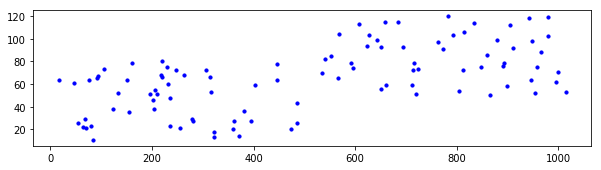
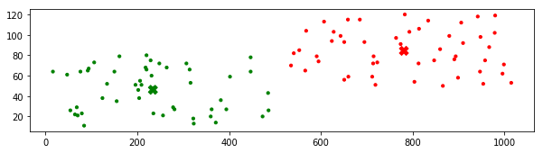
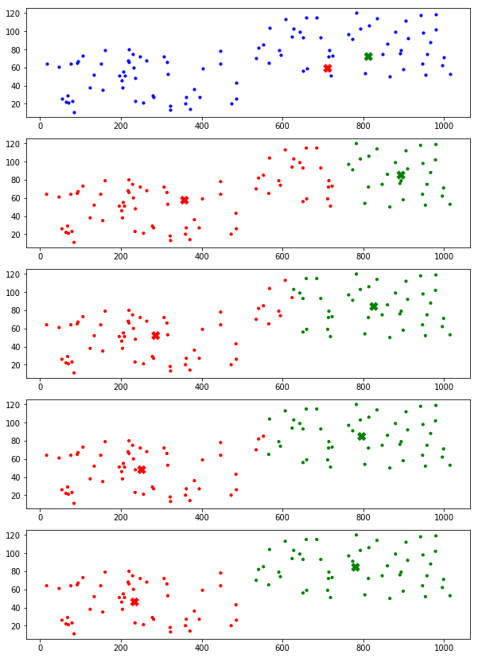
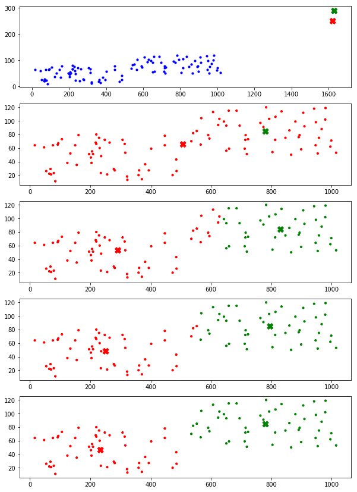

# K-Means 聚类

聚类属于无监督学习的一种。聚类和分类是不同的，分类是已知有哪些类别，需要将数据划分到这些类别中去；聚类是不知道有哪些类别，由算法将数据划分成指定的类别数。

聚类算法有很多，其中很基础的就是 K-Means（K 均值）聚类算法

**K-Means 的基本步骤：**

- 随机初始化聚类中心
- 每个样本计算到各个聚类中心的距离，每个样本和自身距离最近的聚类中心归为一类
- 对划分的每一类重新计算聚类中心
- 重复二、三步直至聚类中心不变


**初始化方法**

基础的 K-Means 初始化聚类中心是随机的，也就是说，从所有样本点中随机取 k 个样本点（假如希望聚k类）作为聚类中心。这样，初始的聚类中心可以保证一定在数据集的范围之内。

K-Means 是对初始的聚类中心很敏感的，随机选择出来的点可能相互之间距离会非常近，这样第一次聚类的效果就会不太好。针对这一问题，有人提出了 kmeans++ 方法进行初始化，这一方法可以使初始化的聚类中心相互之间尽可能离得远一些，提高聚类的效果。但 kmeans++ 不在本文讨论的范畴。


**距离计算**

假设有三个数据点：$(x_1, y_1)$, $(x_2, y_2)$, $(x_3, y_3)$；两个聚类中心：$(a_1, b_1)$, $(a_2, b_2)$

那么计算第一个数据点到第一个聚类中心距离的式子就是 $distance = \sqrt{(x_1-a_1)^2+(y_1-b_1)^2}$

以此类推。


**聚类中心更新**

假设第一类有两个数据点：$(x_1, y_1)$, $(x_2, y_2)$

那么计算第一类中新的聚类中心 x 坐标的式子就是$x=\frac{x_1+x_2}{2}$


**下面用构建一个简单数据集来演示聚类过程**

首先随机构造一个可以被分为两类的数据集

```python
# 构建数据集
n_samples = 50  # 数据集大小

import random
cluster_a = [(random.randint(10,500), random.randint(10, 80)) for i in range(n_samples)]     # a 类数据
cluster_b = [(random.randint(520,1020), random.randint(50, 120)) for i in range(n_samples)]  # b 类数据

# 可视化初始数据
import matplotlib.pyplot as plt
plt.figure(figsize=(10, 2.5))  # 设置画布大小
plt.subplot("111")
X = cluster_a + cluster_b
plt.scatter([x[0] for x in X], [x[1] for x in X], c="b", s=10)
```


    <matplotlib.collections.PathCollection at 0x1b6e0c1fe10>





构建好了数据集，接下来**先用现成的工具包看一下聚类的效果**

sklearn.cluster 封装的是聚类算法，其中自然包括 K-Means 算法。通过现成的封装代码看一下聚类的效果，有一个直观的感受。

```python
# 使用 sklearn.cluster 工具完成聚类  ##
from sklearn.cluster import KMeans
kmeans = KMeans(n_clusters=2, init="k-means++")  # "random" 表示随机初始化聚类中心，"k-means++" 是改进过的初始化方法
result = kmeans.fit_predict(X)  # 训练聚类模型并完成聚类
centers = kmeans.cluster_centers_  # 类别中心点（有的出处称其为质心）

# 可视化聚类结果
colors = ["red", "green"]
plt.figure(figsize=(10, 2.5))  # 设置画布大小
plt.subplot("111")
plt.scatter([x[0] for x in X], [x[1] for x in X], c=[colors[x] for x in result], s=10)
plt.scatter([x[0] for x in centers], [x[1] for x in centers], c=colors, marker="X", s=100)
```


    <matplotlib.collections.PathCollection at 0x1b6e0931da0>





接下来，就**根据 K-Means 的原理，动手实现一下算法**

```python
## 根据聚类原理实现聚类算法  ##
```


```python
# 代码一
# 质心初始化为数据集中的任两个数据点
# 只绘制最后结果

# [centers_a, centers_b] = [random.choice(X) for x in range(2)]  # 初始化质心，此处在数据集中随机选两个质心
[centers_a, centers_b] = [(random.randint(10,1020), random.randint(10, 120)) for x in range(2)]  # 初始化质心，此处在一定范围内随机选两个点

max_iteration = 300  # 最大迭代次数
clusters = []  # 保存聚类结果
for i in range(max_iteration):
    distance_a = [(x[0]-centers_a[0])**2+(x[1]-centers_a[1])**2 for x in X]  # 计算各点到质心 a 的距离
    distance_b = [(x[0]-centers_b[0])**2+(x[1]-centers_b[1])**2 for x in X]  # 计算各点到质心 b 的距离
    clusters = [0 if dis[0] < dis[1] else 1 for dis in zip(distance_a, distance_b)]  # 根据距离归类，距离 a 近为 0，否则为 1
    # 根据归类结果划分数据
    predict_a = []
    predict_b = []
    for index, x in enumerate(X):
        if clusters[index] == 0:
            predict_a.append(x)
        else:
            predict_b.append(x)
    # 重新计算质心
    temp_a = (sum([x[0] for x in predict_a])/len(predict_a), sum([x[1] for x in predict_a])/len(predict_a))
    temp_b = (sum([x[0] for x in predict_b])/len(predict_b), sum([x[1] for x in predict_b])/len(predict_b))
    if temp_a == centers_a and temp_b == centers_b:  # 质心不再变化
        print("End at iteration:", i)
        break
    else:
        centers_a = temp_a
        centers_b = temp_b

# 可视化聚类结果
plt.figure(figsize=(10, 2.5))  # 设置画布大小
colors = ["red", "green"]
centers = [centers_a, centers_b]
plt.subplot("111")
plt.scatter([x[0] for x in X], [x[1] for x in X], c=[colors[x] for x in clusters], s=10)
plt.scatter([x[0] for x in centers], [x[1] for x in centers], c=colors, marker="X", s=100)
```

    End at iteration: 3


    <matplotlib.collections.PathCollection at 0x1b6df151908>


上面的代码只展示了最后结果，下面是把**每一次迭代后的效果都展示出来**，可以清晰地看到聚类的整个过程。

```python
# 代码二
# 质心初始化为数据集中的任两个数据点
# 展示每一步结果

[centers_a, centers_b] = [random.choice(X) for x in range(2)]  # 初始化质心，此处在数据集中随机选两个质心
# [centers_a, centers_b] = [(random.randint(10,1020), random.randint(10, 120)) for x in range(2)]  # 初始化质心，此处在一定范围内随机选两个点


max_iteration = 30  # 最大迭代次数
clusters = []  # 保存聚类结果
plt.figure(figsize=(10, max_iteration*3))  # 设置画布大小
colors = ["red", "green"]

# 绘制初始情况
plt.subplot(max_iteration, 1, 1)
centers = [centers_a, centers_b]
plt.scatter([x[0] for x in X], [x[1] for x in X], c='b', s=10)
plt.scatter([x[0] for x in centers], [x[1] for x in centers], c=colors, marker="X", s=100)

for i in range(max_iteration):
    distance_a = [(x[0]-centers_a[0])**2+(x[1]-centers_a[1])**2 for x in X]  # 计算各点到质心 a 的距离
    distance_b = [(x[0]-centers_b[0])**2+(x[1]-centers_b[1])**2 for x in X]  # 计算各点到质心 b 的距离
    clusters = [0 if dis[0] < dis[1] else 1 for dis in zip(distance_a, distance_b)]  # 根据距离归类，距离 a 近为 0，否则为 1
    # 根据归类结果划分数据
    predict_a = []
    predict_b = []
    for index, x in enumerate(X):
        if clusters[index] == 0:
            predict_a.append(x)
        else:
            predict_b.append(x)
    # 重新计算质心
    if len(predict_a) != 0:  # 在一定范围内随机取点时，可能出现全部被划分为同一类的情况，此时另一类为空，需保证下式除数不为零
        temp_a = (sum([x[0] for x in predict_a])/len(predict_a), sum([x[1] for x in predict_a])/len(predict_a))
    if len(predict_b) != 0:
        temp_b = (sum([x[0] for x in predict_b])/len(predict_b), sum([x[1] for x in predict_b])/len(predict_b))

    if temp_a == centers_a and temp_b == centers_b:  # 质心不再变化
        print("End at iteration:", i)
        break
    else:
        centers_a = temp_a
        centers_b = temp_b
    
    # 可视化每次的聚类结果
    centers = [centers_a, centers_b]
    plt.subplot(max_iteration, 1, i+2)
    plt.scatter([x[0] for x in X], [x[1] for x in X], c=[colors[x] for x in clusters], s=10)
    plt.scatter([x[0] for x in centers], [x[1] for x in centers], c=colors, marker="X", s=100)
```

    End at iteration: 4





上面代码使用的初始化方法都是随机地在数据集中选取两个点作为聚类中心，下面的代码演示的是在一定范围内选取两个随机点作为聚类中心，也就是说聚类中心不在数据集当中产生。自然，这种方法的效果是没有上面的好的，但不妨尝试一下。

```python
# 代码三
# 质心初始化为一定范围内的任两个点
# 展示每一步结果

# [centers_a, centers_b] = [random.choice(X) for x in range(2)]  # 初始化质心，此处在数据集中随机选两个质心
[centers_a, centers_b] = [(random.randint(0,2000), random.randint(0, 300)) for x in range(2)]  # 初始化质心，此处在一定范围内随机选两个点

max_iteration = 30  # 最大迭代次数
clusters = []  # 保存聚类结果
plt.figure(figsize=(10, max_iteration*3))  # 设置画布大小
colors = ["red", "green"]

# 绘制初始情况
plt.subplot(max_iteration, 1, 1)
centers = [centers_a, centers_b]
plt.scatter([x[0] for x in X], [x[1] for x in X], c='b', s=10)
plt.scatter([x[0] for x in centers], [x[1] for x in centers], c=colors, marker="X", s=100)

for i in range(max_iteration):
    distance_a = [(x[0]-centers_a[0])**2+(x[1]-centers_a[1])**2 for x in X]  # 计算各点到质心 a 的距离
    distance_b = [(x[0]-centers_b[0])**2+(x[1]-centers_b[1])**2 for x in X]  # 计算各点到质心 b 的距离
    clusters = [0 if dis[0] < dis[1] else 1 for dis in zip(distance_a, distance_b)]  # 根据距离归类，距离 a 近为 0，否则为 1
    # 根据归类结果划分数据
    predict_a = []
    predict_b = []
    for index, x in enumerate(X):
        if clusters[index] == 0:
            predict_a.append(x)
        else:
            predict_b.append(x)
    # 重新计算质心
    if len(predict_a) != 0:  # 在一定范围内随机取点时，可能出现全部被划分为同一类的情况，此时另一类为空，需保证下式除数不为零
        temp_a = (sum([x[0] for x in predict_a])/len(predict_a), sum([x[1] for x in predict_a])/len(predict_a))
    if len(predict_b) != 0:
        temp_b = (sum([x[0] for x in predict_b])/len(predict_b), sum([x[1] for x in predict_b])/len(predict_b))

    if temp_a == centers_a and temp_b == centers_b:  # 质心不再变化
        print("End at iteration:", i)
        break
    else:
        centers_a = temp_a
        centers_b = temp_b
    
    # 可视化每次的聚类结果
    centers = [centers_a, centers_b]
    plt.subplot(max_iteration, 1, i+2)
    plt.scatter([x[0] for x in X], [x[1] for x in X], c=[colors[x] for x in clusters], s=10)
    plt.scatter([x[0] for x in centers], [x[1] for x in centers], c=colors, marker="X", s=100)
```

    End at iteration: 4





以上是关于基本 K-Means 算法的全部内容，代码已上传至 [GitHub](<https://github.com/NICE-FUTURE/WorkSpace/blob/master/python/machineLearning/k-means/k_means.ipynb>)